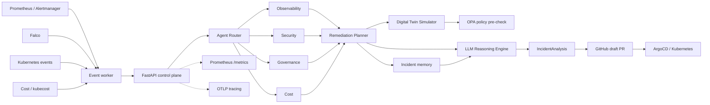

# AegisForge


**AegisForge** turns infrastructure events into reviewable, simulated,
policy-checked GitOps changes - with humans on the merge button. It is an
opinionated reference architecture for AI-assisted SRE / DevSecOps that runs
end-to-end out of the box.

Built by **Michael Opoku-Gyimah** — GitHub: [`mikegyim`](https://github.com/mikegyim)

---

## What it actually does

1. Accepts an `InfrastructureEvent` on `POST /events`
2. Runs four concurrent inspection agents (observability, security, governance, cost)
3. Synthesizes a `RemediationPlan` (structured, with rollback + GitOps patch)
4. Simulates the plan against a `DigitalTwin` cluster graph (blast radius + OPA pre-check)
5. Calls a real LLM (Anthropic / OpenAI / mock fallback) to produce the executive summary and root-cause hypothesis grounded in the agent evidence and any prior similar incidents
6. Persists the analysis in SQLite with token-overlap similarity search
7. On request, opens a **draft GitHub pull request** with the Helm values diff via PyGithub - or a dry-run proposal when running locally
8. Exposes Prometheus metrics, structured JSON logs, and optional OpenTelemetry traces

Nothing mutates a cluster until a human merges the PR. `enable_autonomous_actions` is `false` by default and the simulator blocks plans that would fail the OPA policy.

---

## Capabilities and where to find them

| Capability                            | Where in the code                                      |
| ------------------------------------- | ------------------------------------------------------ |
| FastAPI control plane                 | `apps/api/src/aegisforge/main.py`                      |
| Multi-agent inspection                | `apps/api/src/aegisforge/agents.py`                    |
| Real LLM reasoning (with fallback)    | `apps/api/src/aegisforge/{llm,ai}.py`                  |
| Remediation plan + Helm values diff   | `apps/api/src/aegisforge/remediation.py`               |
| Digital twin simulator (graph-based)  | `apps/api/src/aegisforge/simulation.py`                |
| SQLite incident memory + similarity   | `apps/api/src/aegisforge/memory.py`                    |
| GitHub draft PR generation            | `apps/api/src/aegisforge/gitops.py`                    |
| API-key auth, rate limit, headers     | `apps/api/src/aegisforge/security.py`                  |
| Prometheus metrics + OTLP tracing     | `apps/api/src/aegisforge/observability.py`             |
| Event-driven background worker        | `apps/agents/src/aegisforge_agents/{queue,worker}.py`  |
| Dashboard (Vite + React)              | `apps/frontend/src/main.jsx`                           |
| Helm chart (HPA, PDB, NetworkPolicy)  | `charts/aegisforge/`                                   |
| Kustomize base + dev/prod overlays    | `infra/kubernetes/`                                    |
| Terraform: VPC + EKS + IRSA + ECR     | `infra/terraform/aws/`                                 |
| OPA admission policy                  | `security/policies/`                                   |
| CI: ruff, bandit, pytest, trivy, helm | `.github/workflows/ci.yml`                             |

---

## Architecture



---

## Local quickstart

### 1. API + dashboard

```bash
# API
cd apps/api
python -m venv .venv && source .venv/bin/activate
pip install -e ".[dev]"
uvicorn aegisforge.main:app --reload
# -> http://localhost:8000/docs

# Frontend
cd apps/frontend
npm install
npm run dev
# -> http://localhost:5173
```

### 2. Fire the demo events

```bash
./scripts/demo.sh
```

### 3. Wire in real Anthropic reasoning

```bash
export AEGIS_LLM_PROVIDER=anthropic
export AEGIS_ANTHROPIC_API_KEY=sk-ant-...
pip install -e "apps/api[llm]"
uvicorn aegisforge.main:app --reload
```

Then re-run the demo - `llm_provider` in the response will switch from `mock` to `anthropic` and the `executive_summary` / `root_cause_hypothesis` will be model output grounded in the agent findings and similar incidents.

### 4. Open a real (draft) pull request

```bash
export AEGIS_GITHUB_TOKEN=ghp_...
export AEGIS_GITHUB_REPOSITORY=mikegyim/aegisforge-infra
export AEGIS_GITHUB_DRY_RUN=false
curl -X POST http://localhost:8000/incidents/<incident_id>/pull-request
```

---

## Tests and CI

```bash
cd apps/api && pytest -q          # unit + integration
cd apps/agents && pytest -q       # worker queue
helm lint charts/aegisforge
terraform -chdir=infra/terraform/aws fmt -check && terraform -chdir=infra/terraform/aws init -backend=false && terraform -chdir=infra/terraform/aws validate
conftest verify --policy security/policies
```

CI runs all of the above plus `bandit` (SAST) and `trivy` (image scan).

---

## Deploying

### Docker

```bash
docker build -t aegisforge:0.2.0 .
docker run -p 8000:8000 aegisforge:0.2.0
```

### Helm

```bash
kubectl create namespace aegisforge
kubectl -n aegisforge create secret generic aegisforge-secrets \
  --from-literal=anthropic_api_key=$AEGIS_ANTHROPIC_API_KEY \
  --from-literal=github_token=$GITHUB_TOKEN \
  --from-literal=api_key=$AEGIS_API_KEY
helm upgrade --install aegisforge charts/aegisforge -n aegisforge
```

### AWS (Terraform)

```bash
cd infra/terraform/aws
terraform init && terraform apply
# Outputs: cluster_name, cluster_endpoint, ecr_repository_url, irsa_role_arn
```

---

## Why this project exists

Most "AI for SRE" demos stop at "LLM summarizes an alert". AegisForge tries to
answer the harder question: **how do you let an LLM propose infrastructure
changes without letting it touch anything dangerous?**

The answer here is a chain of cheap deterministic checks - rule-based agents,
a digital twin, an OPA pre-check, a draft PR with a rollback plan - wrapped
around a single grounded LLM call. The result is reviewable by a human in the
same way any other infrastructure change is.

---

## Resume bullet

> Built AegisForge, an autonomous AI cloud-ops control plane: FastAPI +
> multi-agent inspection, LLM-grounded incident reasoning with SQLite memory,
> digital-twin blast-radius simulation, OPA policy pre-check, and PyGithub
> draft-PR generation. Helm-packaged, EKS-deployable via Terraform, observable
> via Prometheus + OTLP, CI-tested with ruff / bandit / trivy / conftest.

---

## License

MIT © 2026 Michael Opoku-Gyimah
