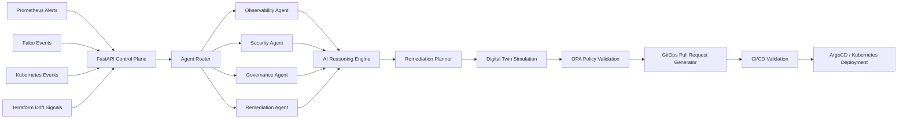

# AegisForge


AegisForge is an autonomous AI cloud operations and defense platform that combines Kubernetes platform engineering, AI agents, DevSecOps automation, infrastructure simulation, and GitOps remediation workflows into a unified cloud-native control plane.

Built by **Michael Opoku-Gyimah** / GitHub: [`mikegyim`](https://github.com/mikegyim)

Built as a portfolio demonstration of:

- AI infrastructure engineering
- Distributed systems
- Kubernetes platform operations
- DevSecOps automation
- Cloud-native architecture
- Autonomous remediation systems
- GitOps workflows
- AI-assisted incident response

---

# What This Project Demonstrates

| Capability | Where in the Code |
|---|---|
| FastAPI AI control plane | `apps/api/src/aegisforge/main.py` |
| Multi-agent orchestration | `apps/api/src/aegisforge/agents.py` |
| AI reasoning engine | `apps/api/src/aegisforge/ai.py` |
| Autonomous remediation planning | `apps/api/src/aegisforge/remediation.py` |
| Kubernetes digital twin simulation | `apps/api/src/aegisforge/simulation.py` |
| GitHub Actions CI/CD | `.github/workflows/ci.yml` |
| Terraform infrastructure provisioning | `infra/terraform/` |
| Kubernetes manifests | `infra/kubernetes/` |
| Helm packaging | `charts/aegisforge/` |
| Security policy enforcement | `security/policies/` |
| Event-driven AI workers | `apps/agents/` |
| Infrastructure simulation engine | `simulation/` |

---

# Core Features

- Real-time infrastructure event ingestion
- AI-powered incident analysis and summarization
- Policy-aware remediation planning
- Autonomous GitOps remediation proposal generation
- Security event classification
- Kubernetes digital twin simulation
- Prometheus/Grafana-ready metrics endpoints
- REST API built with FastAPI
- AI agent framework for observability, governance, security, and remediation
- Docker, Kubernetes, Helm, Terraform, and GitHub Actions integration

---

# Production Features

- Async FastAPI APIs
- Kubernetes-native deployment model
- Helm packaging
- Terraform Infrastructure-as-Code
- GitHub Actions CI/CD
- AI-driven remediation workflows
- GitOps-oriented deployment strategy
- Policy-aware infrastructure automation
- Simulation-based safety validation
- Security event classification
- Cloud-native architecture patterns

---

# Architecture



---

# Repository Structure

```text
aegisforge/
├── apps/
│   ├── api/
│   ├── agents/
│   └── frontend/
├── infra/
│   ├── kubernetes/
│   └── terraform/
├── charts/
├── security/
├── simulation/
├── docs/
├── examples/
└── .github/workflows/
```

---

# Local Quickstart

## Start the API

```bash
cd apps/api

python -m venv .venv

# Linux/macOS
source .venv/bin/activate

# Windows Git Bash
source .venv/Scripts/activate

pip install -e ".[dev]"

uvicorn aegisforge.main:app --reload
```

Open:

```text
http://localhost:8000/docs
```

---

# Run Tests

```bash
cd apps/api
pytest -v
```

---

# Example Event

```bash
curl -X POST http://localhost:8000/events \
  -H "Content-Type: application/json" \
  -d @../../examples/events/node-memory-pressure.json
```

---

# Example AI Incident Workflow

1. Infrastructure event enters control plane
2. Event is routed through specialized AI agents
3. AI reasoning engine generates root-cause analysis
4. Remediation planner proposes infrastructure fix
5. Digital twin simulator estimates blast radius
6. OPA/Gatekeeper policies validate remediation
7. GitOps pull request is generated
8. CI/CD validates infrastructure changes
9. Approved deployment syncs to Kubernetes

---

# Future Roadmap

- [x] API control plane
- [x] Agent orchestration framework
- [x] AI reasoning abstraction
- [x] Kubernetes simulation engine
- [x] Terraform scaffolding
- [x] Kubernetes manifests
- [x] GitHub Actions CI/CD
- [ ] LangGraph multi-agent workflows
- [ ] pgvector incident memory
- [ ] OpenAI + Bedrock production providers
- [ ] Falco runtime integration
- [ ] Prometheus live metric ingestion
- [ ] ArgoCD pull request automation
- [ ] React topology dashboard
- [ ] Real-time infrastructure graph visualization
- [ ] Autonomous remediation approval workflows

---

# Why This Project Exists

Most infrastructure tools stop at monitoring and alerting.

AegisForge explores what comes next:

- AI-assisted infrastructure reasoning
- Autonomous remediation systems
- Simulation-based deployment safety
- Distributed AI operational agents
- Cloud-native AI control planes

The goal is to demonstrate how AI can augment SRE, DevSecOps, and Kubernetes operations workflows without removing human oversight.

---

# Resume Bullet

> Built AegisForge, an autonomous AI cloud operations and defense platform using FastAPI, Kubernetes, Terraform, Helm, AI agents, policy validation, simulation-based remediation, and GitOps-style infrastructure automation workflows.

---

# License

MIT License © 2026 Michael Opoku-Gyimah
